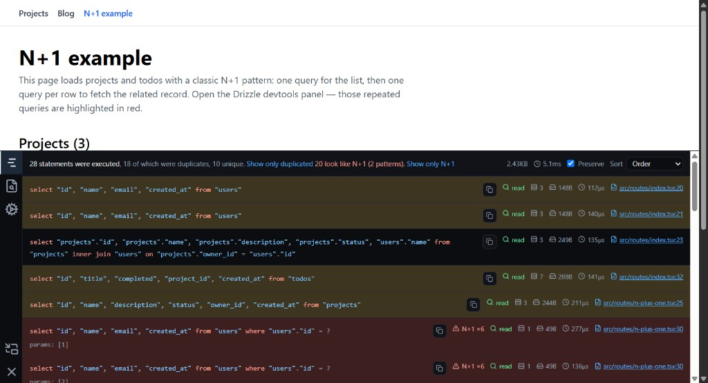

# tanstack-drizzle-devtools



Request-scoped Drizzle query logging for TanStack Start. See every SQL statement that ran for the current page — in the TanStack Devtools panel, with timing, row counts, duplicate detection, and clickable source links.

Development only. Nothing is logged or shipped in production builds.

## Requirements

- [TanStack Start](https://tanstack.com/start)
- [Drizzle ORM](https://orm.drizzle.team/)
- [TanStack Devtools](https://tanstack.com/devtools) (`@tanstack/react-devtools` + `@tanstack/devtools-vite`)

SQLite instrumentation (`instrumentDatabase`) is included for `better-sqlite3`. Other drivers work with the Drizzle logger alone — you get SQL and params, but row counts and byte sizes may be missing unless you add your own instrumentation.

## Install

```bash
npm i -D tanstack-drizzle-devtools
```

Peer dependencies you should already have in a TanStack Start + Drizzle app:

```bash
npm i @tanstack/react-start drizzle-orm
npm i -D @tanstack/react-devtools @tanstack/devtools-vite @tanstack/devtools-event-client
```

## Integration

### 1. Register middleware in `src/start.ts`

Request middleware captures queries during SSR and injects them into the initial HTML. Function middleware sends queries to the client after each server-function call (client-side navigations).

```ts
import { createStart } from '@tanstack/react-start'
import {
  createQueryLogFunctionMiddleware,
  createQueryLogMiddleware,
} from 'tanstack-drizzle-devtools/server'

const devtoolsOptions = {
  enabled: process.env.NODE_ENV === 'development',
  alertOnNPlusOne: true, // optional: browser alert when N+1 is detected
}

export const startInstance = createStart(() => ({
  requestMiddleware: [createQueryLogMiddleware(devtoolsOptions)],
  functionMiddleware: [createQueryLogFunctionMiddleware(devtoolsOptions)],
}))
```

### 2. Attach the Drizzle logger (and optional SQLite instrumentation)

In your database client, enable the logger in development. For `better-sqlite3`, also wrap the native database so queries get accurate duration, row count, and payload size.

```ts
import Database from 'better-sqlite3'
import { drizzle } from 'drizzle-orm/better-sqlite3'
import {
  createDrizzleQueryLogger,
  instrumentDatabase,
} from 'tanstack-drizzle-devtools/server'

const sqlite = new Database(process.env.DATABASE_URL!)

if (process.env.NODE_ENV === 'development') {
  instrumentDatabase(sqlite)
}

export const db = drizzle(sqlite, {
  schema,
  logger:
    process.env.NODE_ENV === 'development'
      ? createDrizzleQueryLogger()
      : false,
})
```

### 3. Add the TanStack Devtools plugin

In your root route shell, mount the bootstrap component and register the Drizzle panel as a devtools plugin. Keep `TanStackDevtools` outside any `isDev` wrapper — `@tanstack/devtools-vite` strips conditional JSX and can break production builds.

```tsx
import { TanStackDevtools } from '@tanstack/react-devtools'
import {
  DrizzleDevtoolsPanel,
  DrizzleQueryBootstrap,
} from 'tanstack-drizzle-devtools/client'

const isDev = import.meta.env.DEV

const devtoolsPlugins = [
  // ...your other plugins
  {
    id: 'drizzle-devtools',
    name: 'Drizzle',
    render: <DrizzleDevtoolsPanel />,
  },
]

function RootDocument({ children }: { children: React.ReactNode }) {
  return (
    <html lang="en">
      <head>{/* ... */}</head>
      <body>
        {children}
        {isDev && <DrizzleQueryBootstrap />}
        <TanStackDevtools
          config={{ position: 'bottom-right' }}
          plugins={devtoolsPlugins}
        />
        <Scripts />
      </body>
    </html>
  )
}
```

Define the `devtoolsPlugins` array at module scope so the plugin list is not recreated on every render.

### 4. Enable the Vite devtools plugin

Required for “open in editor” links on query source locations.

```ts
import { defineConfig } from 'vite'
import { devtools } from '@tanstack/devtools-vite'
import { tanstackStart } from '@tanstack/react-start/plugin/vite'

export default defineConfig({
  plugins: [
    devtools({
      // Recommended: avoids server↔client console piping feedback loops.
      consolePiping: { enabled: false },
    }),
    tanstackStart(),
    // ...
  ],
})
```

## Usage

1. Run your app in development (`npm run dev`).
2. Open TanStack Devtools (bottom-right by default).
3. Select the **Drizzle** tab.

The panel shows queries for the **current page view**:

- **Full page load** — queries are injected into the HTML and picked up on hydration.
- **Client-side navigation** — queries from the route loader’s server function are pushed automatically.

Navigate between routes and the log updates to reflect only what ran for that navigation.

### Panel features

- Syntax-highlighted SQL with bound parameters
- Summary: total statements, duplicates, unique count
- Sort by order, duration, or SQL text
- Filter to duplicated queries only
- Per-query: read/write badge, row count, payload size, duration, source file link
- Copy SQL to clipboard

## How it works

Queries are collected in an `AsyncLocalStorage` store for the lifetime of each server request or server-function call. The Drizzle `logger` hook records SQL; optional SQLite instrumentation enriches entries with timing and row metadata.


| Path                   | Mechanism                                                                                                                     |
| ---------------------- | ----------------------------------------------------------------------------------------------------------------------------- |
| SSR / document request | `createQueryLogMiddleware` injects `window.__DB_QUERIES__` into the HTML; `DrizzleQueryBootstrap` reads it on the client      |
| Client navigation      | `createQueryLogFunctionMiddleware` returns the query log via `sendContext`; the client publishes it to the devtools event bus |


The panel subscribes to `queries-update` events and replaces the list on each page transition — there is no global query history across navigations.

## API

### Server (`tanstack-drizzle-devtools/server`)


| Export                               | Description                                                       |
| ------------------------------------ | ----------------------------------------------------------------- |
| `createQueryLogMiddleware()`         | Request middleware — ALS scope + HTML injection                   |
| `createQueryLogFunctionMiddleware()` | Server-function middleware — pushes queries on client navigations |
| `createDrizzleQueryLogger()`         | Drizzle `Logger` implementation                                   |
| `instrumentDatabase(db)`             | Wraps `better-sqlite3` `Database` for timing / row count / size   |


Both middleware factories accept `QueryLogMiddlewareOptions`: `enabled` (defaults to `NODE_ENV === 'development'`) and `alertOnNPlusOne` (defaults to `false`).

### Client (`tanstack-drizzle-devtools/client`)


| Export                  | Description                                                    |
| ----------------------- | -------------------------------------------------------------- |
| `DrizzleDevtoolsPanel`  | TanStack Devtools plugin panel                                 |
| `DrizzleQueryBootstrap` | Reads initial SSR query payload; mount once in your root shell |


## Limitations

- **Development only** — disable via `enabled: false` or `NODE_ENV` checks.
- **Per-navigation scope** — the log resets when you navigate; it does not accumulate across the session.
- **Source locations** — stack traces often point at Drizzle internals (`query-promise.ts`) because server functions are bundled; route files are preferred when present in the stack.
- **SQLite-first instrumentation** — `instrumentDatabase` targets `better-sqlite3`; other drivers need custom wrappers if you want row counts and sizes.

## Contributing

Contributions are welcome. See [CONTRIBUTING.md](CONTRIBUTING.md) for setup, workflow, and pull request guidelines.

## License

[MIT](LICENSE)

## Acknowledgments

Inspired by [PHP Debug Bar](https://php-debugbar.com/), the in-browser debug bar for PHP applications.

